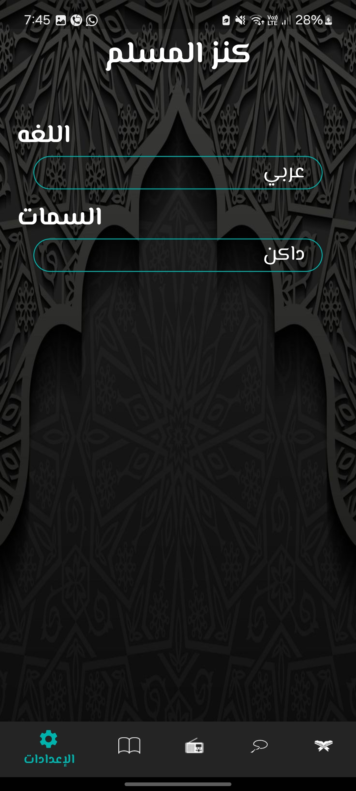
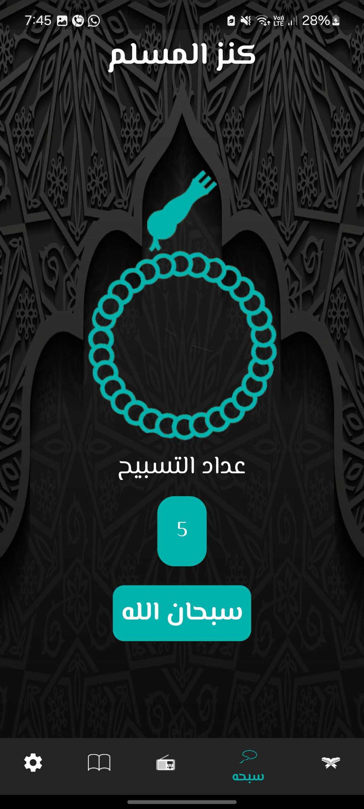

# Kanz al Muslim

My project is list view of Quran , Ahadith and  Sebha counter , play audio of radio

## Getting Started

This project is a starting point for a Flutter application.

A few resources to get you started if this is your first Flutter project:

- [Lab: Write your first Flutter app](https://docs.flutter.dev/get-started/codelab)
- [Cookbook: Useful Flutter samples](https://docs.flutter.dev/cookbook)

For help getting started with Flutter development, view the
[online documentation](https://docs.flutter.dev/), which offers tutorials,
samples, guidance on mobile development, and a full API reference.

Ui App:

| col 1      | col 2      |
|------------|-------------|
|  | |
| |  |
| | |
|||
||  |
|||
||  |
